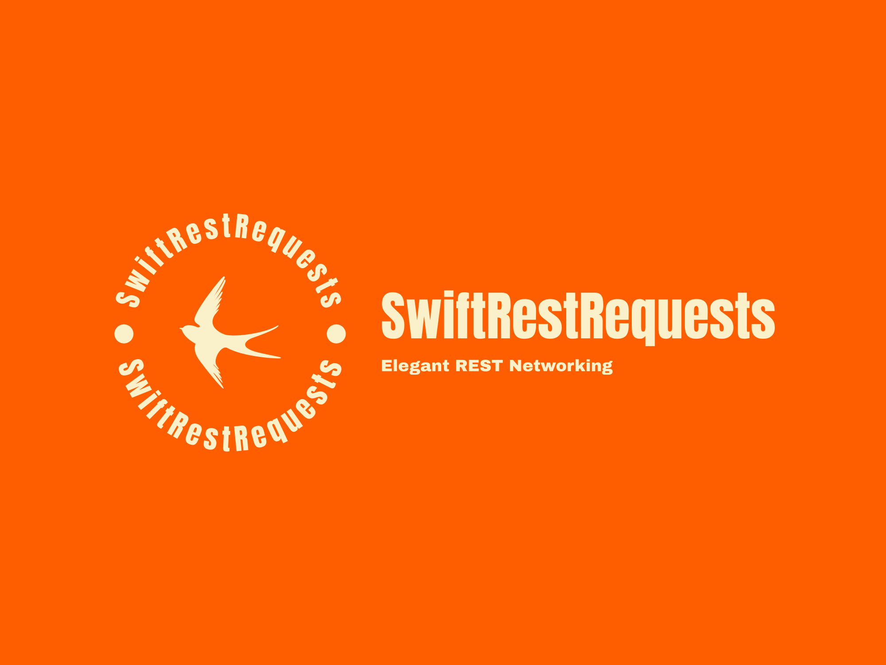

[](https://github.com/tkausch/SwiftRestRequests/actions/workflows/Swift.yml/badge.svg)
[](https://img.shields.io/badge/Swift-5.7_5.8_5.9-Orange?style=flat-square)
[](https://img.shields.io/badge/Platforms-macOS_iOS_tvOS_watchOS_vision_OS_Linux-Green?style=flat-square)
[](https://img.shields.io/badge/Swift_Package_Manager-compatible-orange?style=flat-square)

# SwiftRestRequests

SwiftRestRequests is a lightweight, async/await-first HTTP client written in pure Swift. It helps you build strongly typed REST clients with minimal boilerplate by leaning on Swift's `Codable` system for both request and response models.

The library is built on top of Foundation's `URLSession`, so it stays 100% compliant with App Transport Security (ATS) while running everywhere Swift does.

## Highlights

- Async/await API for `GET`, `POST`, `PUT`, `PATCH`, and `DELETE`
- Automatic encoding/decoding via `Encodable` and `Decodable`
- Response validation and consistent error handling with `RestError`
- Request interceptors, custom headers, and configurable timeouts
- Built-in support for Basic and Bearer auth as well as TLS/public-key pinning
- Native logging hooks through `swift-log`, including `OSLogHandler` on Apple platforms

## Requirements

SwiftRestRequests 1.6.3+ supports the following minimum environments:

- iOS 15.0+
- iPadOS 15.0+
- tvOS 15.0+
- watchOS 8.0+
- macOS 12.0+
- Linux (Swift 5.7 or newer)

> Toolchain: Swift 5.9 (Xcode 15) or newer.

## Installation

SwiftRestRequests is distributed as a Swift Package. You can add it via Xcode or directly in your `Package.swift`.

### Xcode

1. Open your project or workspace.
2. Choose `File > Add Packages…`
3. Enter `https://github.com/tkausch/SwiftRestRequests`
4. Pick the latest release (recommended) and finish the wizard.

### Package.swift

```swift
dependencies: [
    .package(url: "https://github.com/tkausch/SwiftRestRequests", from: "1.6.3")
]
```

## Quick Start

A common pattern is to subclass `RestApiCaller` and expose one method per REST endpoint. Each method can return a tuple containing the decoded response and the HTTP status, or just an `Int` status for endpoints without a body.

```swift
final class ClientApi: RestApiCaller {
    func myGetMethod() async throws -> (HttpBinResponse?, Int) {
        try await get(HttpBinResponse.self, at: "get")
    }

    func myStatusGetMethod() async throws -> Int {
        try await get(at: "status/204")
    }
}

let baseURL = URL(string: "https://httpbin.org")!
let client = ClientApi(baseUrl: baseURL)

Task {
    do {
        let (response, status) = try await client.myGetMethod()

        print("Status:", status)
        print("URL:", response?.url ?? "n/a")
        print("Origin:", response?.origin ?? "n/a")
        print("Accept header:", response?.headers.accept ?? "n/a")
    } catch RestError.failedRestCall(let httpResponse, let status, let error) {
        print("Request failed with status:", status)
        print("Response:", httpResponse)
        print("Error:", String(describing: error))
    }
}
```

The request and response types you pass into `RestApiCaller` must conform to `Encodable` and `Decodable` (or `Codable` when you need both directions). Using shared model objects keeps your API definitions concise and strongly typed.

## Using `RestApiCaller` Directly

You can also create an instance of `RestApiCaller` and call endpoints without subclassing.

```swift
let baseURL = URL(string: "https://httpbin.org")!
let apiCaller = RestApiCaller(baseUrl: baseURL)
```

### GET request returning a decoded response

```swift
struct HttpBinHeaders: Decodable {
    let accept: String

    enum CodingKeys: String, CodingKey {
        case accept = "Accept"
    }
}

struct HttpBinResponse: Decodable {
    let url: String
    let origin: String
    let headers: HttpBinHeaders
}

let (response, status) = try await apiCaller.get(HttpBinResponse.self, at: "get")

print("Status:", status)
print("URL:", response?.url ?? "n/a")
```

### POST request with an `Encodable` payload

```swift
struct HttpBinRequest: Encodable {
    let key1: String
    let key2: Int
    let key3: Float
    let key4: Bool
    let key5: [Int]
}

struct HttpBinResponse: Decodable {
    let json: HttpBinRequest
}

let request = HttpBinRequest(key1: "Hello", key2: 1, key3: 2.0, key4: true, key5: [1, 2, 3, 4, 5])

let (response, status) = try await apiCaller.post(request, at: "post", responseType: HttpBinResponse.self)

print("Status:", status)
print("JSON payload:", response?.json ?? request)
```

## Certificate Pinning

Apple added native support for SSL public key pinning in iOS 14 (and the corresponding platform releases). The recommended reading is Apple’s article [Identity Pinning: How to configure server certificates for your app](https://developer.apple.com/news/?id=g9ejcf8y).

Key takeaways:

- Declare trusted certificates in `Info.plist` so ATS knows what to expect per domain.
- A pinned CA key must appear in either an intermediate or a root certificate.
- Pins are domain-bound; connections are rejected when the requirement is not met.
- Multiple public keys can be associated with a single domain.

This native pinning works seamlessly with `URLSession`, and therefore with SwiftRestRequests. If you prefer to manage pinning in code, use the built-in `CertificateCAPinning` and `PublicKeyServerPinning` delegates alongside `HttpSession`.

## Logging and Observability

SwiftRestRequests integrates with the [swift-log](https://github.com/apple/swift-log) ecosystem. Plug in your preferred logging backend or use the provided `OSLogHandler` for unified logging across Apple platforms.

## Request Interceptors

Implement custom interceptors to mutate requests or responses, e.g. to inject headers, refresh tokens, or track analytics. Interceptors run before the request is sent and after the response is received, giving you full control over the network pipeline.

## Need Help?

Check the `Examples` directory (coming soon) or open a GitHub discussion with questions and ideas. Contributions are welcome—feel free to submit issues or pull requests!
